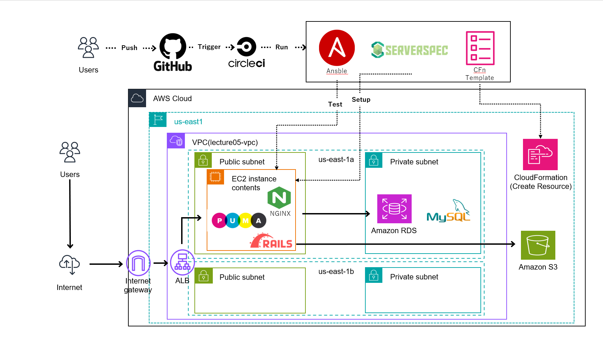

# RaiseTech AWSフルコース

##概要
- 2024/5月から受講開始
- 最終課題としてCI/CDパイプラインを用いたRailsアプリケーションのインフラストラクチャの自動構築と稼働の実施
- 学習記録の掲載

##インフラ構成図

##実施内容
1. AWS CloudFormationを使用して、VPC・EC2・RDS・ALB・S3を構築
2. Ansibleを用いて、Railsアプリケーション実行環境の自動構築
3. Serverspecを使用して、構築したサーバーの自動テストを実施
4. CircleCIを用いて、上記プロセスのパイプラインを構築と自動化

## 学習記録
|講座|課題|レポート|備考|
|:---|:---|:---|:---|
|第1回|AWSアカウントの作成 IAMユーザーの作成 ルートユーザーとIAMユーザーのMFA保護 IAMユーザーでBilling閲覧設定 Cloud9の作成|-|
|第2回|GitHubアカウントの作成 課題提出用リポジトリの作成とブランチ保護ルールの追加 Cloud9のGit設定変更|[lecture02.md](lecture02.md)|-|
|第3回|RailsサンプルアプリケーションをCloud9上でデプロイ APサーバーの動作確認 DBサーバーの動作確認 Railsの構成管理ツールの確認 |[lecture03.md](lecture03.md)|-|
|第4回|VPCの作成 EC2の作成 RDSの作成 EC2からRDSに接続 |[lecture04.md](lecture04.md)|-|
|第5回|1. 組み込みサーバー（Puma）でRailsサンプルアプリをデプロイ 2. Webサーバー（Nginx）とAPサーバー（Unicorn）でデプロイ 3. ELB（ALB）の追加 4. S3の追加 5. 構成図の作成|[lecture05.md](lecture05.md)|-|
|第6回|CloudTrail（証跡）のイベント履歴確認 CloudWatch（監視・通知）アラームを使ったALBのアラーム設定 AWS利用料の見積書作成 AWSの請求とコスト管理から現在の利用料確認|[lecture06.md](lecture06.md)|-|
|第7回|第5回で構築した環境の脆弱性とその対策|[lecture07.md](lecture07.md)|-|
|第8回|課題なし 第5回課題のライブコーディング視聴-1|-|
|第9回|課題なし 第5回課題のライブコーディング視聴-2|-|
|第10回|第5回課題で構築した環境をCloudFormationで構築|[lecture10.md](lecture10.md) [lecture10](lecture10)|-|
|第11回|ServerSpecによるインフラの自動テスト|[lecture11.md](lecture11.md) [lecture11_spec.rb](lecture11/sample_spec.rb)|-|
|第12回|CI/CDツール CircleCIの使用|[lecture12.md](lecture12.md)|-|
|第13回|プロビジョニングツールとCI/CDツールの併用|実施中|CircleCIでCFn→ansible→ServerSpecのワークフローを回す|
|第14回|第13回課題のライブコーディング-1-|該当なし|-|
|第15回|第13回課題のライブコーディング-2-|該当なし|-|
|第16回|現場へ出ていくにあたって|該当なし|-|