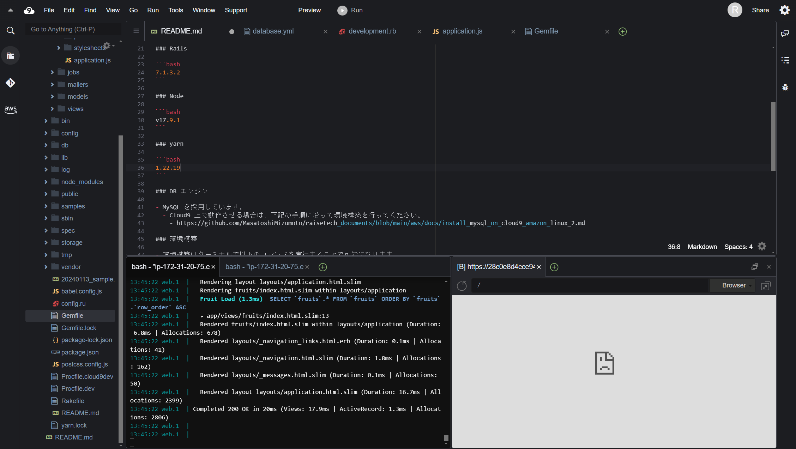
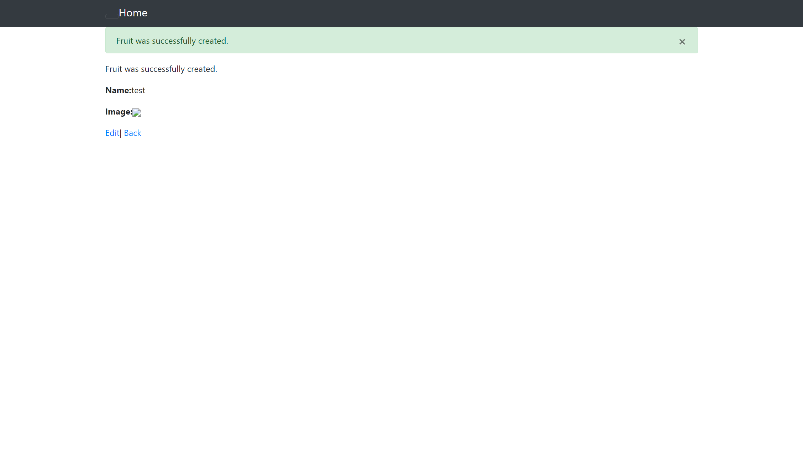
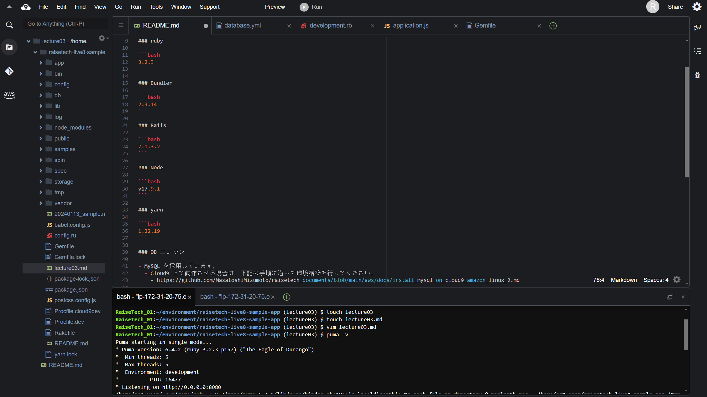
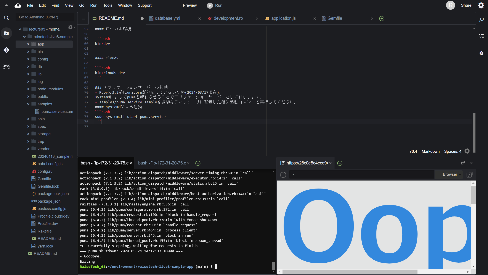
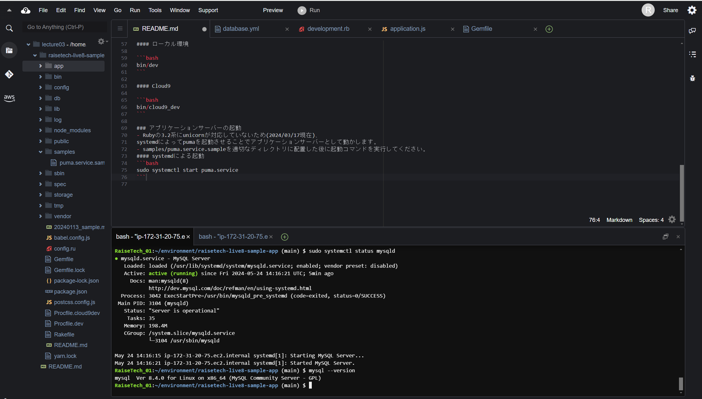
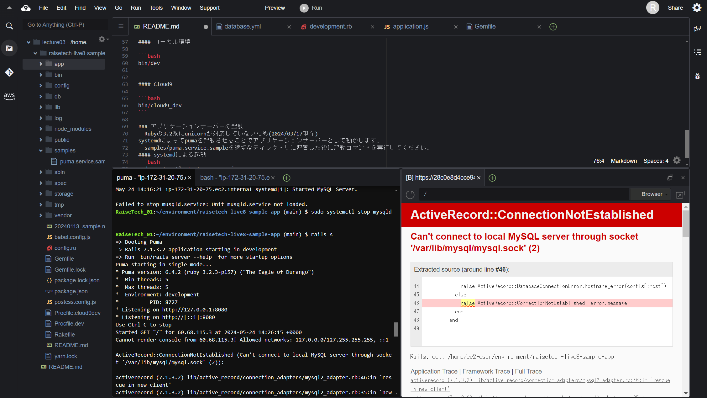

## 第3回課題

### 1.サンプルアプリケーションの起動
    
　　

   ブラウザで起動し、testの画像を登録した状態
   
　　
　　
　　
### 2.APサーバーについて

1. APサーバーの名前とversionの確認

　　'puma ver6.4.2'
　　
　　
　　

2. APサーバーを終了させた場合のアクセスの確認

　　
　　

   APサーバーを終了させた場合、アクセスできなくなる

### 3.DBサーバーについて

1. DBサーバーの名前とCloud9 で動作しているversionの確認

  'mysqlver 8.4.0'
  
　　

2. DB サーバーを終了させた場合のアクセス確認

　　
    
   DBサーバーを終了させた場合、アクセスできなくなる

3. Railsの構成管理ツールの名前

   'Bundler'

### 4. 今回の課題の学習と感想
* ブラウザに表示させるまでがすごく苦労した。
* 何度も調べては試して失敗してを繰り返していたので、やめたくなったが、あきらめずに取り組んだことで達成感は半端なかった。
* これからもあきらめずに挑戦していこうと思います。

