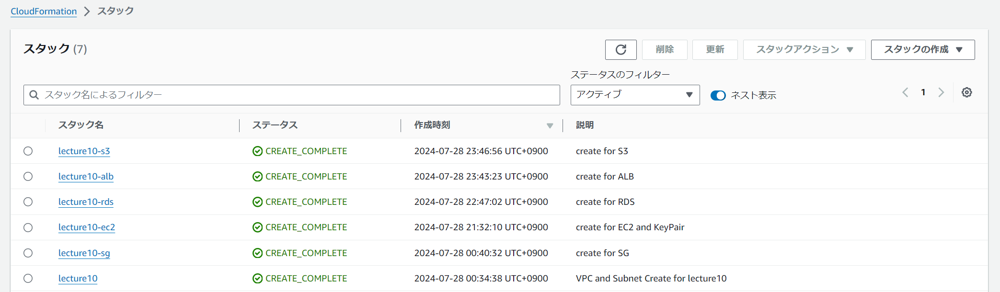

# 第10回課題

## 構成
* 構成は大きくは、[第5回](./lecture05.md)の構成図の通りとなるように進めました。
* 下表の各スタック単位でYMLファイルおきました。
  * [lecture10_CloudFormation_Template](./lecture10/lecture10_CloudFormation_Template/)
* 下表の各スタック単位でレポートを分けました。表内のリンクを参照。
  
|スタック|リソースなど|備考|リンク|
|:---|:---|:---|:---|
|lecture10|VPC IGW PublicSubnet PrivateSubnet RouteTable |VPCのID SubnetのID|[01_vpc.md](./lecture10/01_vpc.md)|
|lecture10-sg|以下リソース用のSG ・EC2（APサーバ） ・ALB ・RDS（MySQL）|sgのID(用途ごと)|[02_sg.md](./lecture10/02_sg.md)|
|lecture10-ec2|キーペア EC2 IAM|EC2インスタンスのID|[03_ec2.md](./lecture10/03_ec2.md)|
|lecture10-rds|RDS|MySQL|[04_rds.md](./lecture10/04_rds.md)|
|lecture10-alb|TagetGroup ALB|EC2と紐づけ|[05_alb.md](./lecture10/05_alb.md)|
|lecture10-s3|S3|DL可にする|[06_s3.md](./lecture10/06_s3.md)|

## 作成したスタック一覧（CloudFormationコンソール画面）

## 感想
* スタック作成時にymlファイルの構成が間違っているせいでエラーが出て、それを解決しての繰り返しをすることが多く、苦労した。
* 今回、ymlファイルを作成する際に組み込み関数を使用したことで理解することができたが、理解するまで少し時間がかかってしまった。
* 今回の課題提出でymlファイルを1つにするか、複数に分けて提出するかどうするか迷った。
* 毎回、同じ構成を作成するとは限らないので各サービスごとに分けてファイルを作成することで違う構成を作成する際にも流用できると思い分けて作成した。
