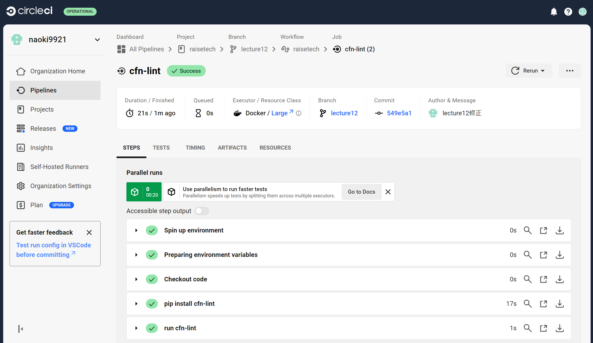

## 第12回課題
### 課題内容
**CircleCI の[サンプルコンフィグ](sample-config.yml)が正しく動作するようにリポジトリに組み込む**


### 実施内容
**以下の内容の通りに修正**<br>
* サンプルコンフィグ
````
version: 2.1
orbs:
  python: circleci/python@2.0.3
jobs:
  cfn-lint:
    executor: python/default
    steps:
      - checkout
      - run: pip install cfn-lint
      - run:
          name: run cfn-lint
          command: |
            cfn-lint -i W3002 -t cloudformation/*.yml
workflows:
  raisetech:
    jobs:
      - cfn-lint
````
* 修正後のymlファイル
````
version: 2.1
orbs:
  python: circleci/python@2.0.3
jobs:
  cfn-lint:
    executor: python/default
    steps:
      - checkout
      - run: pip install cfn-lint
      - run:
          name: run cfn-lint
          command: |
            cfn-lint -i W3002 -t lecture10/lecture10_CloudFormation_Template/*.yml
workflows:
  raisetech:
    jobs:
      - cfn-lint
````


### 実施結果
* 以下のエラーが出力された<br>
  - AZのハードコーディング
  - ParametersであるVpcIdを使用していない
  - AWSの動的参照（Dynamic References）を使用していない<br>
  

* 解決方法
  - ハードコーディングエラー<br>
  以下のように修正することで解決<br>


  - ParametersであるVpcIdを使用していないエラー<br>
  vpc.ymlからOutputsで呼び出しているため、記載されている文言を削除<br>


  - AWSの動的参照（Dynamic References）を使用していないエラー<br>
  動的参照（Dynamic References）を使用することで解決<br>


* 修正後、成功されたことを確認<br>



### 感想
* コミットするたびに自動でCloudFormationのテンプレートファイルをテストしてくれるので、コードの不備確認が楽になるなと思った。
* 最初はテストの自動化というものがどんなものなのか理解できなかったが、実際にCircleciを実行することで便利なツールであることがわかった。
* 不備が散見されており、少しショックではあったがこれから気を付けようと思えたので学びが増えてよかったと思う。
